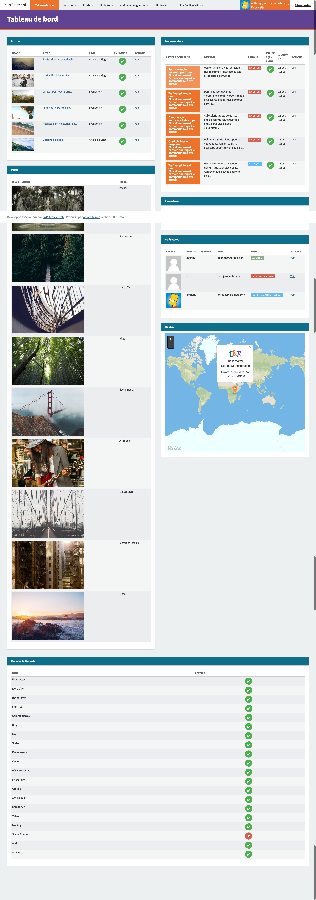

  
  
  
  

  
  
  

<h1 align='center'>
  Rails Starter
</h1>

  This project has been built to increase speed when creating a new application:   it's annoying to reconfigure always and always the same gems so this starter pack comes with   plugins already configured such as activeadmin, devise, globalize, and many others.

  
  
  

### Requirements
Install [Foreman](https://github.com/ddollar/foreman)  
Install [Maildev](https://github.com/djfarrelly/MailDev)  
Install [Memcached](http://memcached.org/)  

### Usage
Clone it: `git clone git@github.com:lr-agenceweb/rails-starter.git`  
Duplicate `.env.example`, rename it in `.env` and set correct values  
Duplicate `application.example.yml` and rename it in `application.yml`  
Duplicate `database.example.yml` and rename it in `database.yml`  
Setup your environment variable (database, secret key, devise key, ...)  
Go to the application folder: `cd rails-starter`  
Install gems: `bundle install`  
Create database: `rake db:create`  
Load schema: `rake db:schema:load`  
Seed datas: `rake db:seed`  
Run `foreman start`  
Visit `http://localhost:3000`  
That's it !  

### Stack

 Technology                                                                        | Description
---------------------------------------------------------------------------------- | -----------
| This project use unicorn in local development.   The server is launched using `foreman start`
    | It use `MySQL2` but you can choose to use `PostgreSQL`, `SQlite` or `MariaDB`.   To create a dump of your database, run `rake db:backup`
 | It use [Slim](https://github.com/slim-template/slim-rails) template to write HTML views.
 | Style is writting in `scss` and `sass` (using libsass)   Scripts are created in `coffeescript`
 | Caching is handled by `memcached` with [Dalli](https://github.com/petergoldstein/dalli)
 | It use [maildev](http://djfarrelly.github.io/MailDev/) NodeJS package to test emails in local.   You don't have nothing to do, `maildev` server will be launched in the same time as the rails server with `foreman start`.   To see your mails, visit `http://localhost:1080`
Units Tests | Vanilla rails tests are included, just run `rake test`
Code structure | This project follow most of [Rubocop](https://github.com/bbatsov/rubocop) rules

### Tasks
#### Rails 

* Color Routes: colored version of rake routes (run `rake color_routes`)
* Dump SQL: make a quick save of your Database (run `rake db:backup`)

#### Capistrano

* **Uploads**  
  * `cap <env> upload:yml` : Upload yml configuration files such as application, database, secrets, ...
  * `cap <env> upload:dkim` : Upload DKIM private key
  * `cap <env> upload:missing` : Upload default pictures when missing or unavailable paperclip model objects
  * `cap <env> upload:seeds` : Upload seeds fixtures files before in order to seed database
  * `cap <env> upload:all` : Execute all previous commands in one task

* **Database backup**  
  * `cap <env> backup:upload_config` : Upload backup config file to remote server (needs [Backup](http://backup.github.io/backup/v4/) gem to be installed)

* **Logrotate**  
  * `cap <env> logrotate:upload` : Upload logrotate config file to remote server

* **Nginx**  
  * `cap <env> nginx:upload:vhost` : Upload vhost config file to remote server (create file in conf.d)
  * `cap <env> nginx:upload:vhost_ssl` : Same as above with SSL configuration for vhost (Let's Encrypt)
  * `cap <env> nginx:vhost:disable` : Disable vhost (rename extension to .disabled)
  * `cap <env> nginx:vhost:enable` : Enable vhost (rename extension to .conf)
  * `cap <env> nginx:vhost:remove` : Remove uploaded vhost to conf.d folder

* **Paperclip**  
  * `cap <env> paperclip:refresh:all` : Regenerate all Paperclip styles
  * `cap <env> paperclip:refresh:missing` : Regenerate only missing Paperclip styles

### Modules

Name                | Description
------------------- | -----------
**Newsletter**      | In order to avoid spam email when sending newsletter to subscribers, you will need to sign your email address using SPF and DKIM keys and linked them to your DNS.   Be sure to generate a `dkim.private.key` and `dkim.public.key` and move the `dkim.private.key` in `config/dkim` folder.
**Blog**            | Write blog articles.
**Slider**          | Add a slider on the page you want and customize its options.
**Comment**         | Add comments for posts or blogs articles.
**Guest Book**      | Allow users (connected or not) to leave a message in the guest book.
**Event**           | Create events (with start date and end date)
**Map**             | Display a Mapbox map of your organization or business
**Social Network**  | Display social networks icons to share your site or let users to follow you on this networks
**Breadcrumb**      | Show a breadcrumb on the page of your site
**Video**           | Upload your own videos or add it from video platform such as Youtube or Dailymotion
**Calendar**        | Choose start date and end date for your Events
**Background**      | Display a background image for your pages
**QrCode**          | Show a contact QrCode on the website
**Adult**           | Display a popup the first time you access the website to inform you than you must be over 18 to continue your visit
**RSS**             | Add a RSS feed to the website
**Search**          | Add a search form to look on title or content post articles
**Mailing**         | Application developped to send heavy mails number to users
**SocialConnect**   | Allow users to LINK their ALREADY EXISTING Devise account to Facebook, Twitter or Google Social Connect.

### Screenshots

### Thanks
A big thanks to [Grafikart](http://grafikart.fr) for all his amazing tutorials !

### Contributing
1. Fork it
2. Create your feature branch (`git checkout -b my-new-feature`)
3. Commit your changes (`git commit -am 'Add some feature'`)
4. Push to the branch (`git push origin my-new-feature`)
5. Create new Pull Request
