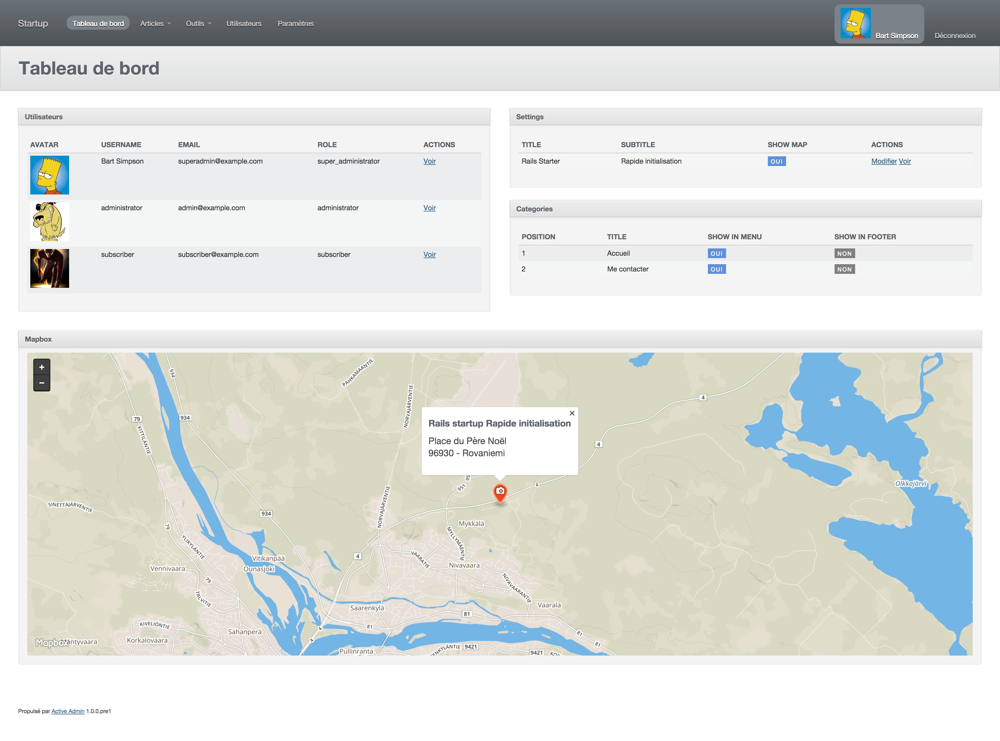

Rails Startup (Work in Progress)
==============

This project has been built to increase speed when creating a new application: it's annoying to reconfigure always and always the same gems so this startup pack comes with plugins already configured such as activeadmin, devise, globalize, and many others.

Requirements:
------------
Install [Foreman](https://github.com/ddollar/foreman)  
Install [Maildev](https://github.com/djfarrelly/MailDev)  

Usage
-----
Clone it: `git clone git@github.com:anthony-robin/rails-startup.git`  
Rename `.env.example` to `.env`  
Rename `database.example.yml` to `database.yml`  
Add your database configuration  
Go to the application folder: `cd rails-startup`  
Install gems: `bundle install`  
Run migrations: `rake db:create db:migrate db:seed`  
Run `foreman start`  
Visit `http://localhost:3000`  
That's it !

Ruby and Rails versions
-----------------------
Ruby 2.2.0  
Rails 4.2  

Server
------
I am using unicorn in local development. The server is launch using `foreman start`

Database
---------
I am using `mysql2` but you can choose to use `SQLite` or any other SGBD.  
To create a dump of your database, run `rake db:backup`

Template
--------
I am using [Slim](https://github.com/slim-template/slim-rails) template to write HTML views.

Assets
-------
Style is writting in `scss` and `sass` (with compass)  
Scripts are created in `coffeescript`

Tasks
------
* Color Routes: colored version of rake routes (run `rake color_routes`)
* Dump SQL: make a quick save of your Database (run `rake db:backup`)

Mail
-----
I use [maildev](http://djfarrelly.github.io/MailDev/) to test my emails in local. You don't have nothing to do, maildev server will be launched in the same time as the rails server with `foreman start`.  
To see your mails, visit `http://localhost:1080`

Gems
-----
### [Globalize](https://github.com/globalize/globalize)
Two languages are included by default: french and english  
  
### [Whenever](https://github.com/javan/whenever)
Setup two Cron tasks:
* Regenerate sitemap everyday
* Make a dump of database every day

To make this tasks active on your server, just run `whenever --update-crontab <name-of-your-site>`  
For more information read the gem documentation.

### [Annotate](https://github.com/ctran/annotate_models)
Print table structure in models  

Units Tests
-----
Basics tests are included, just run `rake test`

Contributing
------------
1. Fork it
2. Create your feature branch (`git checkout -b my-new-feature`)
3. Commit your changes (`git commit -am 'Add some feature'`)
4. Push to the branch (`git push origin my-new-feature`)
5. Create new Pull Request

Bonus
------
* This project follow most of [Rubocop](https://github.com/bbatsov/rubocop) rules

Screenshots
-----------
